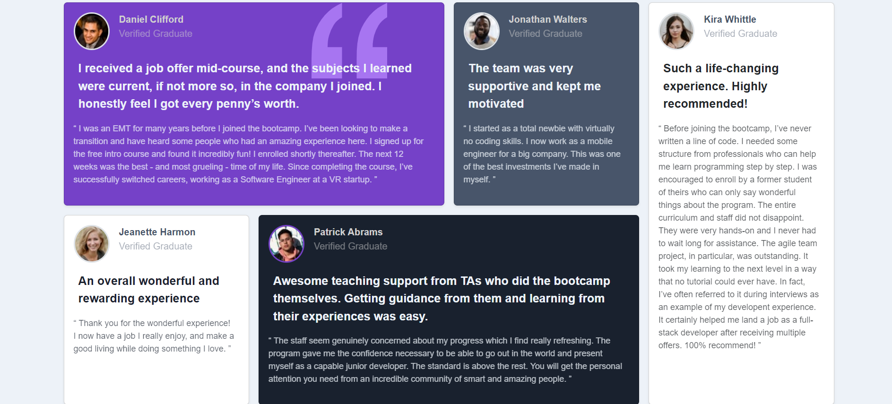

# Frontend Mentor - Testimonials grid section solution

This is a solution to the [Testimonials grid section challenge on Frontend Mentor](https://www.frontendmentor.io/challenges/testimonials-grid-section-Nnw6J7Un7). Frontend Mentor challenges help you improve your coding skills by building realistic projects. 

## Table of contents

- [Overview](#overview)
  - [The challenge](#the-challenge)
  - [Screenshot](#screenshot)
  - [Links](#links)
- [My process](#my-process)
  - [Built with](#built-with)
  - [What I learned](#what-i-learned)
  - [Continued development](#continued-development)
- [Author](#author)

## Overview

### The challenge

Users should be able to:

- View the optimal layout for the site depending on their device's screen size

### Screenshot



### Links

- Solution URL: [solution URL](https://github.com/Diego2Drm/testimonial-grid)
- Live Site URL: [live site URL](https://testimonial-grid-section-main-2d.netlify.app/)

## My process

### Built with

- Semantic HTML5 markup
- CSS custom properties
- Flexbox
- CSS Grid
- Mobile-first workflow
- [Bootstrap 5](https://getbootstrap.com/) - Css framework


### What I learned

```html
  <article class="card h-100 bg-moderate-violet position-relative shadow-sm">
    
      <div class="card-body">
        <div class="d-flex mb-3">
          
          <p class="d-flex row ps-3">
            <span class="text-light-gray fw-bold">Daniel Clifford</span>
            <span class="text-light-gray opacity-50">Verified Graduate</span>
          </p>
        </div>
        <p class="text-light-grayish-blue px-2 fw-bold fs-5 position-relative z-2">
          I received a job offer mid-course, and the subjects I learned were current, if not more so, 
          in the company I joined. I honestly feel I got every penny’s worth.
        </p>
        <p class="text-light-grayish-blue opacity-75 text-size pe-2">
          “ I was an EMT for many years before I joined the bootcamp. I’ve been looking to make a 
          transition and have heard some people who had an amazing experience here. I signed up 
          for the free intro course and found it incredibly fun! I enrolled shortly thereafter. 
          The next 12 weeks was the best - and most grueling - time of my life. Since completing 
          the course, I’ve successfully switched careers, working as a Software Engineer at a VR startup. ”
        </p>
      </div>
  </article>
```
```scss
$theme-colors: (
    "primary": $primary,
    "danger": $danger
);

// Create your own map
$custom-colors: (
    "background": #edf2f8,
    "moderate-violet": #7541c8,
    "very-dark-grayish-blue": #48556a,
    "very-dark-blackish-blue": #19212e,
    "light-gray": #cfcfcf,
    "light-grayish-blue": #ecf2f8,
);

// Merge the maps
$theme-colors: map-merge($theme-colors, $custom-colors);
```

### Continued development

Bootstrap 5

## Author

- Github - [Diego2Drm](https://github.com/Diego2Drm)
- Frontend Mentor - [@Diego2Drm](https://www.frontendmentor.io/profile/Diego2Drm)
- Twitter - [@yourusername](https://www.twitter.com/yourusername)
